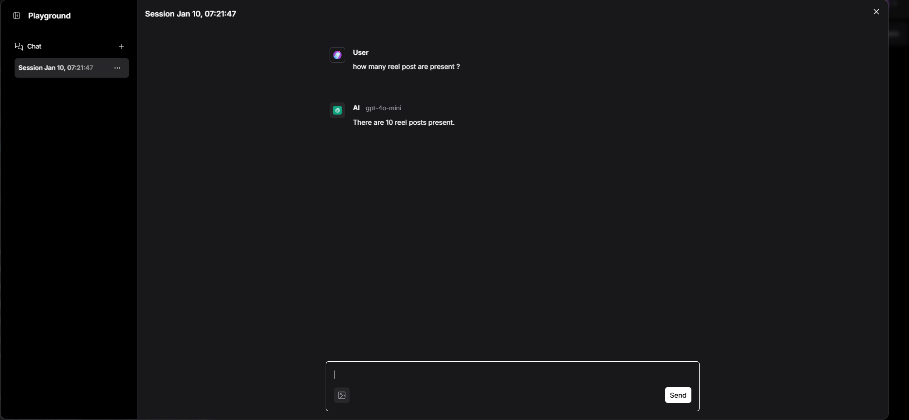
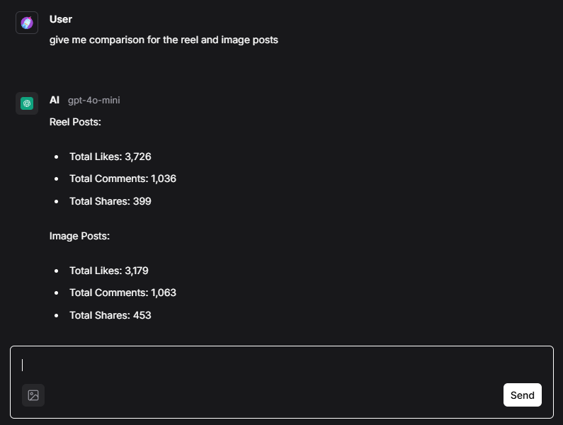

# Social Media Performance Analysis System Using RAG Solution with LLM

This project leverages a Retrieval-Augmented Generation (RAG) approach, using a Large Language Model (LLM) and a vector database to analyze social media performance. Below, we outline the implementation steps and components of this system.

## Overview

The solution is divided into two primary parts:

1. **Inserting Sample Data into the Vector Database**
   - Generate sample data in a randomized format for analysis.
   - Store the generated data in a CSV file.
   - Load the data into Astra Vector DB using two approaches:
    - **LangFlow**: A no-code/low-code tool for data workflows. In this approach, text is parsed using the split-text method with `
    ` as the separator to process each row of the dataset. OpenAI embeddings are then generated using the `text-embedding-3-small` model to create vector representations for database insertion.
    - **Python Script**: A programmatic approach for data ingestion. In this approach, OpenAI embeddings are utilized to generate embeddings based on the content of each row in the dataset. The embeddings are stored in the vector column, while the actual data is stored in the content column as key-value pairs representing a single post.
    - Data is loaded into two separate collections for comparison of both approaches.

2. **Chatbot for Analysis Using the Vector Database**
   - A chatbot interface to interact with the database and generate insights based on user input.
   - The workflow consists of:
     1. **Input Processing**:
        - User input is passed to the vector search in Astra Vector DB.
        - The vector search retrieves similar data and provides context for analysis.
     2. **Prompt Creation**:
        - For System define prompt we used as below
        ```
        System: You are a data analysis assistant. Your goal is to provide direct, concise answers to questions based on the dataset. Avoid including detailed calculations or unnecessary data in your response .provide only the result, no additional data. Focus on clarity and brevity.

        ``` 
        above propt will give direct answer intead of explaining step by step.
        - The retrieved context, user input, and a system-defined prompt are combined to create a structured query.
     3. **LLM Response Generation**:
        - The structured prompt is sent to the AI model.
        - The AI model processes the input to generate an insightful response by combining the user input, retrieved context, and system prompt.
     4. **Output Delivery**:
        - The AI model’s response is displayed in text format to the user via LangFlow.

## Implementation Steps

### 1. Inserting Sample Data into Astra Vector DB

- **Generate Sample Data**:
  Use a Python script to create randomized sample data relevant to the analysis. Save this data in CSV format.

- **Load Data into Astra Vector DB**:
  - **Using LangFlow**: Use the graphical interface of LangFlow to ingest data into the vector database.
  - **Using Python Script**: Write a script to programmatically load the data into the vector database.

- **Store in Collections**:
  Data ingested through both methods is stored in two separate collections for comparison.

### 2. Chatbot Workflow for Analysis

- **User Input**:
  Accepts user input as the basis for analysis.

- **Vector Search**:
  - Perform a similarity search in Astra Vector DB based on the user input.
  - Retrieve relevant data as context for analysis.

- **Prompt Formation**:
  - Combine the retrieved context, user input, and a system-defined prompt to generate a query for the AI model.

- **AI Model Processing**:
  - The structured prompt is passed to the LLM.
  - The AI model uses the user input, retrieved context, and system prompt to generate a response.

- **Display Output**:
  - The chatbot displays the AI-generated response in text format via LangFlow.

## Prerequisites

- Astra Vector DB
- LangFlow (optional for no-code/low-code workflows)

## Outputs 
- When I ask chatbot how many reels present in the database it return proper count

- We can check comparison data also
